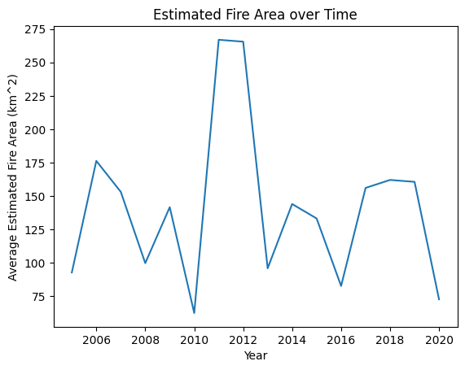
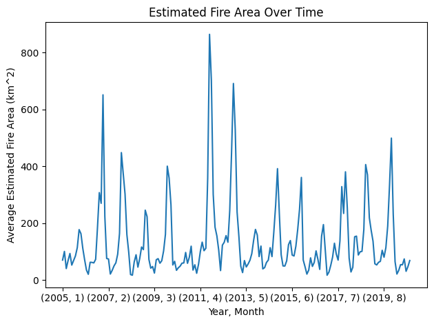
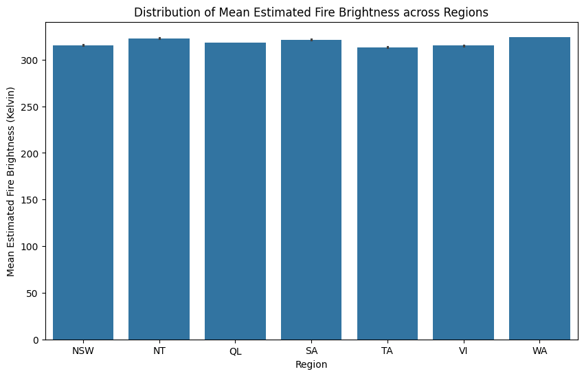
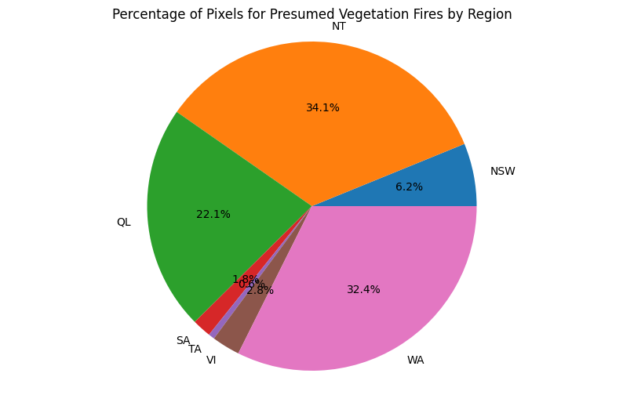
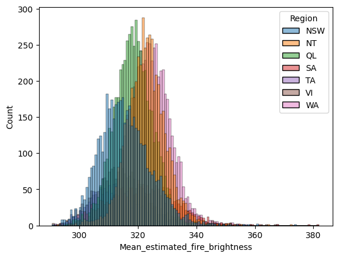
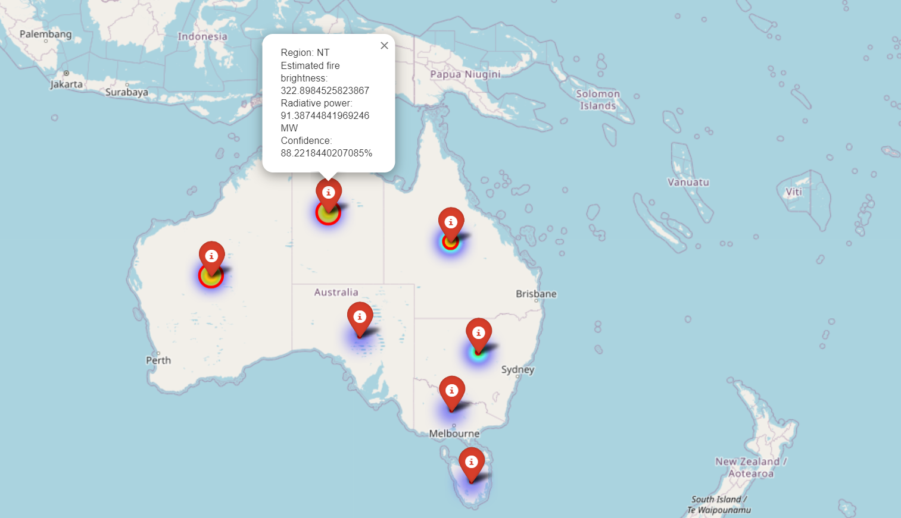

## 🗺️ Interactive Map of Wildfires in Australia

This map shows the distribution of wildfires across Australia. Use the interactive features to explore different regions and data points.

<iframe src="detailed_marker_map.html" width="100%" height="600" style="border:none;"></iframe>

## 🛠️ Tools and Technologies Used


## 📊 Exploratory Data Analysis (EDA)

In this project, extensive exploratory data analysis was performed to understand the behavior and impact of wildfires in Australia. Key visualizations included:

### 1. **Estimated Fire Area Over Years**

- A line chart visualizing the trend of average estimated fire area over the years, providing insights into the frequency and severity of wildfires.



### 2. **Estimated Fire Area Over Time**

- A detailed line plot to analyze the average estimated fire area over time, highlighting seasonal variations and year-to-year changes.


### 3. **Mean Estimated Fire Brightness Across the Regions**

- A bar plot showing the distribution of mean estimated fire brightness (Kelvin) across different regions, indicating variations in wildfire intensity.



### 4. **Fire Pixels by Region**

- A pie chart illustrating the percentage distribution of pixels associated with presumed vegetation fires across various regions.



### 5. **Histogram of the Mean Estimated Fire Brightness**

- A histogram displaying the distribution of the mean estimated fire brightness to analyze the frequency and intensity of wildfires.

```python
sns.histplot(data=df, x='Mean_estimated_fire_brightness', hue='Region')
plt.show()
```


## 🌍 Geospatial Analysis

- An interactive map was created using Folium to visualize the geographical distribution of wildfires across Australia. This map allows for a spatial understanding of wildfire patterns and hotspots, making it a powerful tool for analysis.


## 🌐 Dashboard
An interactive dashboard was developed using Dash and Plotly, enabling users to explore wildfire data dynamically. The dashboard features:

- **Region and Year Selection**: Users can select specific regions and years to visualize wildfire data.
- **Monthly Average Fire Area**: A pie chart showing the average fire area per month for the selected region and year.
- **Monthly Fire Pixels Count**: A bar chart displaying the average count of pixels for presumed vegetation fires by month.


